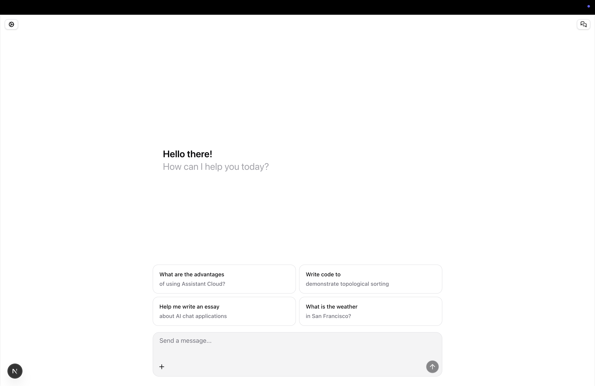
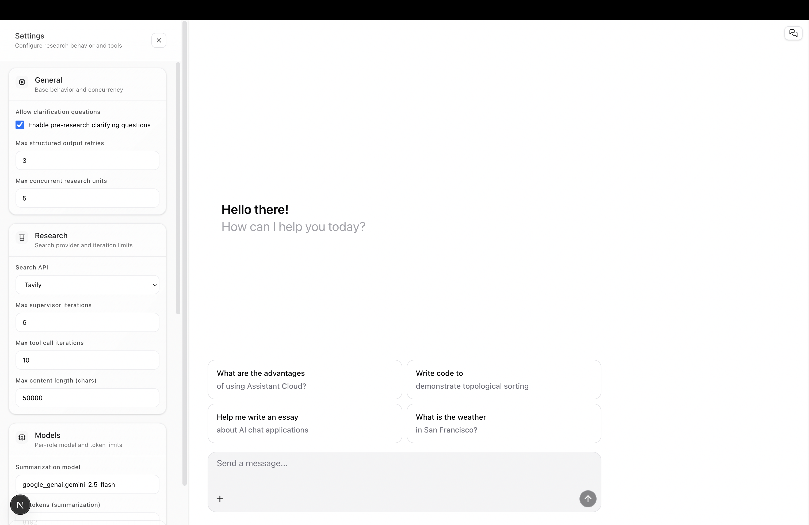
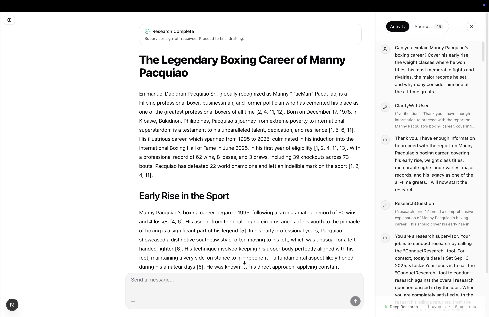

# 🔬 Open Deep Research UI

_Built with ❤️ by [@artreimus](https://github.com/artreimus) from [Ylang Labs](https://github.com/ylang-labs)_

> **A powerful, full-stack deep research application** - Combining a LangGraph backend and a Next.js assistant-UI frontend to deliver comprehensive research capabilities with multiple model providers, search APIs, and optional MCP servers. Local dev friendly; can target LangGraph Cloud/Platform or self-hosted servers.

## 📸 App

## 🏗️ Monorepo Layout

- `backend/` — LangGraph server for Open Deep Research (Python, `uv`, `langgraph-cli`)
- `frontend/` — Next.js app using assistant‑ui and LangGraph SDK

## 🚀 Quick Start (Local)

- Backend
  - `cd backend`
  - `cp .env.example .env` then set provider keys (e.g., `OPENAI_API_KEY`, `TAVILY_API_KEY`, etc.)
  - `uv sync`
  - Start server: `uvx --refresh --from "langgraph-cli[inmem]" --with-editable . --python 3.11 langgraph dev --allow-blocking`
  - Server runs at `http://127.0.0.1:2024` (Studio, API, docs)
- Frontend
  - `cd frontend`
  - Create `.env.local` with:
    - `LANGGRAPH_API_URL=http://127.0.0.1:2024`
    - `NEXT_PUBLIC_LANGGRAPH_ASSISTANT_ID="Deep Researcher"` (matches `backend/langgraph.json`)
    - `LANGCHAIN_API_KEY=...` if your server requires an `x-api-key` (LangGraph Cloud/Platform)
    - Optional: `NEXT_PUBLIC_LANGGRAPH_API_URL=...` to bypass the proxy (requires CORS + client key handling)
  - `pnpm install`
  - `pnpm dev` → open `http://localhost:3000`

Ask a research question in the chat. Use the right‑hand Settings tab to tweak models, search provider, concurrency, and MCP tooling; these are forwarded to the backend as LangGraph configurable fields per run.

## 🌍 Environment

- Backend (`backend/.env`)
  - Model providers: `OPENAI_API_KEY`, `ANTHROPIC_API_KEY`, `GOOGLE_API_KEY`, `OPENROUTER_API_KEY`, `GROQ_API_KEY`, etc.
  - Search: `TAVILY_API_KEY` (default), others optional per your config
  - LangSmith/Platform: `LANGSMITH_API_KEY`, `LANGSMITH_PROJECT`, `LANGSMITH_TRACING`
  - Options: `AUTO_MODEL_SELECTION=true`, `STRICT_PROVIDER_MATCH=false`
  - Optional OAP/Supabase integration: `SUPABASE_URL`, `SUPABASE_KEY`, `GET_API_KEYS_FROM_CONFIG`
- Frontend (`frontend/.env.local`)
  - `LANGGRAPH_API_URL` — Base URL of your LangGraph server
  - `LANGCHAIN_API_KEY` — Added as `x-api-key` by the Next.js proxy when calling the server
  - `NEXT_PUBLIC_LANGGRAPH_ASSISTANT_ID` — Assistant/graph ID (default: `"Deep Researcher"`)
  - `NEXT_PUBLIC_LANGGRAPH_API_URL` — Optional direct browser→server base URL (CORS + API key handling required)

## 🛠️ Dev Commands

- Backend
  - Install: `uv sync`
  - Run: `uvx --refresh --from "langgraph-cli[inmem]" --with-editable . --python 3.11 langgraph dev --allow-blocking`
  - Tests: `uv run -m pytest -q`
  - Lint/Type: `uv run ruff check .` · `uv run mypy src`
- Frontend
  - Dev/Build/Start: `pnpm dev` · `pnpm build` · `pnpm start`
  - Lint: `pnpm lint`

## 🚀 Deployment

- Backend
  - LangGraph Cloud/Platform recommended for durable hosting
  - Self‑hosted: run LangGraph Server behind a load balancer; ensure `x-api-key` or auth is enforced as needed
- Frontend
  - Any Node host (e.g., Vercel). Set env vars to point at your hosted LangGraph server
  - Prefer keeping calls through the built‑in `/api` proxy to attach `x-api-key`

## 💖 Acknowledgments

- **LangChain Team** - For the amazing Open Deep Research framework and LangGraph
- **Assistant UI** - For the excellent assistant-ui components and framework
- **Community** - For feedback, contributions, and support

## 🔧 Troubleshooting

- 401/403 from server: check `LANGCHAIN_API_KEY` and that you are using the `/api` proxy
- Assistant not found: confirm `NEXT_PUBLIC_LANGGRAPH_ASSISTANT_ID` matches backend
- CORS errors: remove `NEXT_PUBLIC_LANGGRAPH_API_URL` (use proxy) or enable CORS on the server

## 📄 License

This project is licensed under the Apache License 2.0. See the [LICENSE](LICENSE) file for details.

---

**⭐ If you find this project useful, please give it a star! ⭐**

Built with ❤️ by [@artreimus](https://github.com/artreimus) from [Ylang Labs](https://github.com/ylang-labs)

